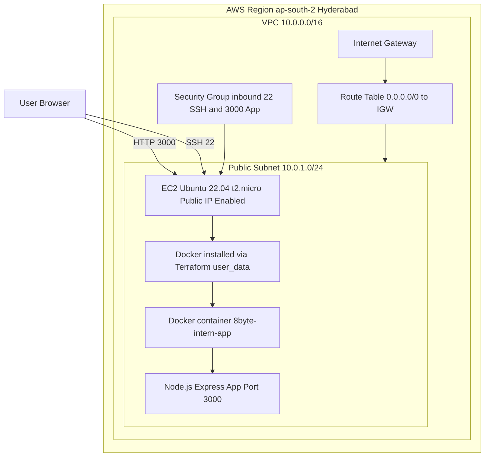

## 8byte DevOps Intern Assignment — Node.js + Docker + Terraform + GitHub Actions (AWS)

## Project Overview
This repository contains a simple Node.js (Express) web application containerized using Docker and deployed on AWS EC2.  
The infrastructure is provisioned using Terraform (Infrastructure as Code).  
A GitHub Actions workflow is included to validate the Docker build on every push to the `main` branch.

The final application is accessible publicly via the EC2 Public IP (or DNS) on port `3000`.

---

## Tech Stack
- **Cloud Provider:** AWS
- **Region:** ap-south-2 (Hyderabad)
- **Infrastructure as Code:** Terraform
- **Compute:** EC2 (Ubuntu 22.04, t2.micro)
- **Containerization:** Docker
- **CI/CD:** GitHub Actions
- **Application Framework:** Node.js (Express)

---

## Application Behavior
When accessed on browser, the application returns:

Intern Assignment Successfully Deployed


---

## Architecture Diagram



## How I did:

# Task 1 — Run Application Locally

Prerequisites

Node.js (LTS recommended)

Steps

Install dependencies:

npm install

Run the application:

node app.js

Verify in browser:

http://localhost:3000


# Task 2 — Dockerize the Application

Prerequisites:

Docker Desktop installed and running

Build Docker image

docker build -t 8byte-intern-app .

Run Docker container

docker run -p 3000:3000 8byte-intern-app

Verify in browser:

http://localhost:3000


# Task 3 — Infrastructure Provisioning using Terraform (AWS)

Prerequisites:

Terraform installed

AWS credentials configured

EC2 Key Pair created in AWS

Provisioned AWS Resources

Terraform provisions the following resources:

VPC

Public Subnet

Internet Gateway

Route Table and Route Table Association

Security Group

SSH access (22)

Application access (3000)

EC2 Instance

Ubuntu 22.04

t3.micro

Public IP enabled

Docker installed using Terraform user_data

Terraform Commands

Move into terraform directory:

cd terraform

Initialize:

terraform init

Plan:

terraform plan

Apply:

terraform apply

After successful apply, Terraform outputs:

EC2 Public IP

EC2 Public DNS


# Task 4 — Deploy Application on EC2

SSH into EC2

ssh -i <your-key>.pem ubuntu@<EC2_PUBLIC_IP>

Verify Docker is installed:

docker --version

Install Git:

sudo apt-get update -y

sudo apt-get install git -y

Clone the repository:

git clone <YOUR_GITHUB_REPO_URL>

cd 8byte-intern-assignment

Build Docker image:

docker build -t 8byte-intern-app .

Run Docker container:

docker run -d -p 3000:3000 --name 8byte-app 8byte-intern-app

Verify container is running:

docker ps

Verification (Public URL)

Open in browser:

http://<EC2_PUBLIC_IP>:3000

Expected output:

8byte Intern Assignment Successfully Deployed


# Task 5 — CI/CD using GitHub Actions

Workflow File Location

.github/workflows/ci.yml

What the Workflow Does

Triggers automatically on push to the main branch

Checks out the repository code

Builds the Docker image using the Dockerfile

Confirms that the Docker build completes successfully

This provides automated validation that the Docker image remains buildable.

Deliverables

Public GitHub repository link containing:

Node.js source code

Dockerfile

Terraform configuration

GitHub Actions workflow

Documentation (README.md, APPROACH.md, CHALLENGES.md)

Public application URL:

http://<EC2_PUBLIC_IP>:3000

Screenshots proving successful deployment and CI pipeline

Notes

Security Group explicitly allows inbound port 3000 for public access.

Docker is installed automatically using Terraform EC2 user_data.

The solution is intentionally minimal and aligned with the assignment requirements.


---

---

###  APPROACH


## Goal
The goal of this assignment is to deploy a simple Node.js application publicly on AWS using:
- Docker for containerization
- Terraform for infrastructure provisioning
- GitHub Actions for CI automation

The approach is intentionally minimal, clear, and aligned with the technical requirements.

---

## Infrastructure Approach (Terraform)
The infrastructure is provisioned using Terraform to ensure:
- Reproducibility
- Clean teardown (`terraform destroy`)
- Clear separation between infrastructure and application

### AWS Components Used
- **VPC + Public Subnet:** Provides an isolated network environment with public access.
- **Internet Gateway + Route Table:** Enables internet access for the public subnet.
- **Security Group:** Allows:
  - SSH access on port `22`
  - Application access on port `3000`
- **EC2 Instance (Ubuntu 22.04, t2.micro):** Hosts the Docker container.

---

## Docker Installation Strategy
Docker is installed automatically using EC2 `user_data` so that:
- No manual installation steps are required after provisioning
- The EC2 instance becomes ready for deployment immediately after creation

---

## Application Deployment Approach
The Node.js application is:
1. Cloned from GitHub into the EC2 instance
2. Built as a Docker image on the EC2 instance
3. Run as a container with port mapping:
   - EC2 port `3000` → Container port `3000`

This ensures the application is accessible publicly via:
- `http://<EC2_PUBLIC_IP>:3000`

---

## CI/CD Approach (GitHub Actions)
A GitHub Actions workflow is included to validate the Docker build process.

### Workflow Goals
- Trigger on push to `main`
- Build Docker image
- Fail fast if Dockerfile or app build breaks

This provides a consistent CI signal and confirms the Docker setup is correct.

---

## Why This Approach
This solution was chosen because it is:
- Simple and beginner-friendly
- Fully aligned with the assignment requirements
- Easy to verify using screenshots and public IP access
- Easy to reproduce and destroy

###  CHALLENGES

# Challenges and Resolutions

This document summarizes the technical challenges faced during the assignment and how they were resolved.

---

## 1) Docker Desktop Setup on Windows

### Challenge

Docker Desktop requires WSL2 or Hyper-V on Windows, and initial setup may fail if WSL2 is not enabled.

### Resolution

- Enabled WSL2 (if required)
- Restarted the system
- Verified Docker was running using:
  ```bash
  docker --version
  
2) Terraform Apply Taking Time for Docker Installation Challenge

Docker installation is performed via EC2 user_data, which may take a few minutes after instance creation.

Resolution

Waited 1–2 minutes after instance provisioning and verified using:

docker --version

3) Application Not Accessible Publicly on Port 3000 Challenge

The application was not reachable initially using:

http://<EC2_PUBLIC_IP>:3000

Resolution

Verified Security Group inbound rules:

SSH (22) open

Custom TCP (3000) open

After confirming inbound rules, the application became accessible.

4) SSH Access Issues from Windows Challenge

SSH connection failed due to incorrect key file path or wrong EC2 username.

Resolution

Confirmed the correct username is ubuntu for Ubuntu AMIs

Used:

ssh -i <your-key>.pem ubuntu@<EC2_PUBLIC_IP>

5) GitHub Actions Workflow Not Triggering Challenge

The GitHub Actions workflow did not trigger initially because the workflow file path was incorrect.

Resolution

Ensured the file was located exactly at:

.github/workflows/ci.yml


Then pushed a commit to main to trigger the pipeline.

Summary

All issues were resolved by verifying configuration step-by-step:

Terraform outputs

Security group rules

Docker installation status

Correct GitHub Actions file structure


---
